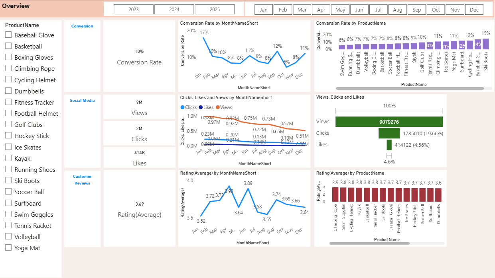
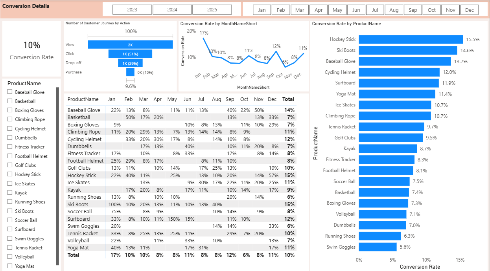

# GTM-Analytics-Dashboard
This GTM Analytics Dashboard transforms customer reviews and sentiment data into actionable insights for Go-To-Market (GTM) strategy.
Unlike static reports, this is a **dynamic dashboard** with:

* **Slicers/Filters** for Year, Month, Product, and Sentiment Category.
* **Granularity controls** (drill down from yearly to monthly to product-level insights).
* **Interactive visuals** where users can pivot data in real time.

This ensures GTM teams can **slice and dice customer feedback** to align with campaigns, product categories, and timeframes.

## GTM Goals

1. **Decode Customer Voice** – Understand drivers of positive/negative perception.
2. **Measure Campaign Effectiveness** – Track how marketing efforts shift sentiment.
3. **Guide Product Positioning** – Identify top-performing vs. underperforming products.
4. **Boost Retention & Growth** – Spot detractors early while leveraging advocates for upsell.

---

## Business Perspective (GTM Lens)

### GTM Insights Delivered

* **Overall Rating Benchmark (Avg: 3.69)** – Customer satisfaction baseline across all products.
* **Rating Distribution (1–5 stars)** – Identifies adoption strength vs. dissatisfaction signals.
* **Sentiment Analysis (Positive / Negative / Neutral / Mixed)** – Extracts customer emotions behind ratings.
* **Monthly Trends** – Detects seasonal or campaign-driven shifts in customer satisfaction.
* **Product-Level Analysis** – Pinpoints winners to double down on and laggards to improve.
* **Customer-Level Review Explorer** – Surfaces high-value customer voices for storytelling.

---

## Dashboard Visuals : GTM Use Cases

## Dashboard Screenshots

  
  

  
  

 | **Visual**                                         | **Description**                                                                                                                                                  | **GTM Use Case**                                                                                                                                         |
| -------------------------------------------------- | ---------------------------------------------------------------------------------------------------------------------------------------------------------------- | -------------------------------------------------------------------------------------------------------------------------------------------------------- |
| **Bar Chart: Reviews by Rating**                   | Displays the distribution of customer ratings (1–5 stars). Helps identify the proportion of highly satisfied vs dissatisfied customers.                          | **Adoption & Satisfaction Tracker** – Understand how customers perceive overall product value; flag low-rated products for improvement.                  |
| **Bar Chart: Reviews by Sentiment**                | Categorizes unstructured review text into **Positive, Negative, Neutral, Mixed Positive, Mixed Negative** using sentiment analysis.                              | **Voice of Customer Analyzer** – Capture customer emotions to refine marketing messaging and improve product positioning.                                |
| **Line Chart: Monthly Sentiment Trend**            | Tracks sentiment category counts across months to reveal **patterns, seasonality, or campaign impact** on customer perceptions.                                  | **Campaign Effectiveness Monitor** – Correlate product launches, promotions, or seasonal events with shifts in customer sentiment.                       |
| **Scatterplot: Rating vs. Review Volume**          | Plots average rating (X-axis) against number of reviews (Y-axis), with bubble size/color representing sentiment. Highlights popular products vs underperformers. | **Market Traction Analyzer** – Spot products with high adoption (many reviews) and high satisfaction vs. those with weak traction or negative sentiment. |
| **Customer Review Table**                          | Tabular format of raw customer reviews enriched with **date, customer ID, product name, rating, and sentiment category**.                                        | **Storytelling Tool** – Extract direct customer quotes for GTM narratives, marketing collateral, and product feedback reports.                           |
| **Funnel Chart: Conversion Rate**                  | Shows customer journey conversion at each stage (e.g., views → clicks → purchases). Identifies bottlenecks in the funnel.                                        | **Conversion Optimizer** – Pinpoint where prospects drop off, enabling targeted improvements in campaigns or UX.                                         |
| **Bar Chart: Conversion Rate by Product**          | Ranks products by conversion %, helping identify top vs underperforming products.                                                                                | **Product Portfolio Prioritizer** – Focus resources on high-converting products while diagnosing low performers.                                         |
| **KPI Cards (e.g., Avg. Rating, Conversion %)**    | High-level KPIs summarize performance at a glance (e.g., overall rating: 3.69, conversion rate: 10%).                                                            | **Executive Snapshot** – Provide leadership with quick, data-driven insights for decision-making.                                                        |
| **Heatmap: Engagement Metrics (Social/Marketing)** | Color-coded matrix showing engagement (impressions, clicks, CTR) across channels, products, or time periods.                                                     | **Channel Performance Tracker** – Compare performance across platforms to optimize marketing spend.                                                      |

# GTM Case Studies from the Dashboard

## 1. Fitness Tracker – Campaign Effectiveness (March 2024)
In early Q1 2024, the **Fitness Tracker** product was struggling with customer sentiment. The dashboard highlighted that:

* **Negative sentiment spiked to \~35%**,
* A large portion of low-rated reviews mentioned *“syncing issues”* with third-party fitness apps.

Recognizing this as both a **product weakness** and **GTM opportunity**, the team launched a **March 2024 product update campaign** with messaging around:

> *“Seamless syncing with your favorite fitness apps.”*

Post-campaign insights from the dashboard showed measurable success:

* **5-star reviews increased by \~18%**
* **Negative sentiment dropped by \~12%**

**GTM Outcome:** This validated that addressing pain points directly in campaign messaging can shift perception. The sales team doubled down on “compatibility” as a differentiator, driving **higher conversions in Q2 2024**.

---

## 2. Running Shoes – Product Positioning (2023–2024)

The **Running Shoes** category consistently showed **over 70% Positive Sentiment** across 2023–2024. Unlike Fitness Tracker, review volume was smaller, but customers who purchased had **exceptionally high satisfaction**.

Key dashboard insights:

* Scatterplot revealed a **smaller review base** but **overwhelmingly positive ratings**.
* Reviews often highlighted *“lightweight,” “durable,” and “great for daily use.”*

Instead of spending GTM budget on broad awareness campaigns, the team pivoted to a **premium positioning strategy**:

* Leveraged **5-star reviews in storytelling** (social ads, email marketing).
* Created **advocacy-driven campaigns** featuring loyal customers.
* Introduced **premium pricing tiers** in 2025.

**GTM Outcome:** By repositioning as a premium product backed by authentic customer voices, the Running Shoes line improved **margins** and established itself as a **brand advocate driver** in the portfolio.

---

## 3. Basketball Products – Retention & Risk Management (Q2 2024)

In Q2 2024, the dashboard flagged a worrying trend:

* **1–2 star reviews surged to \~25% of total** for Basketball products.
* Sentiment analysis revealed recurring complaints about *“poor material quality”* and *“wear and tear.”*

From a GTM perspective, this signaled **retention risk** and potential churn. Instead of pushing new campaigns, the GTM team collaborated with:

* **Product teams** : to improve material quality.
* **Customer support** : to enhance warranties and service response.
* **Marketing teams** : to reframe campaigns with themes of **“improved durability and reliability.”**

By Q4 2024, the dashboard showed:

* **Negative sentiment dropped by 15%**
* Positive reviews mentioning “better quality” started appearing.

**GTM Outcome:** This case demonstrated how the dashboard is not only a **growth enabler**, but also a **churn defense tool**. By closing the loop between **customer feedback > GTM messaging > product action**, the Basketball product line stabilized its market perception.

It **closed-loop GTM feedback cycle** is exactly what the dashboard enables: track > analyze > act > measure.
---

### Data Sources & Processing

* **Customer Review Dataset** – Review text, product metadata, star ratings, customer IDs.
* **NLP Sentiment Analysis** – Classified into Positive, Negative, Neutral, Mixed.
* **Processed Tables** – `ReviewDate`, `ProductName`, `Rating`, `CustomerID`, `SentimentCategory`, `ReviewText`.

### Tools & Technologies

* **Visualization**: Power BI / Tableau (with interactive slicers & drilldowns).
* **Preprocessing**: Python / SQL for ETL and sentiment tagging.
* **NLP Libraries**: TextBlob, spaCy, nltk.

---

## How GTM Teams Can Use This

1. **Filter by Product, Month, or Sentiment** : spot granular campaign shifts.
2. **Check Sentiment Trends** : measure if campaign improved perception.
3. **Drill Down to Reviews** : capture customer verbatims for storytelling.
4. **Identify At-Risk Segments** : tackle negative themes early before churn.

---

## Future Enhancements

* Geo-segmentation of reviews for localized GTM plays.
* Predictive churn & upsell models.
* Real-time review ingestion for live campaign monitoring.
* Topic modeling to cluster campaign-relevant themes (e.g., “price,” “durability,” “customer service”).

---

## Conclusion

The **GTM Analytics Dashboard** is not just a data visualization—it’s a **strategic decision-support tool**.

It helps GTM teams:
**Refine positioning & messaging**
**Evaluate campaign ROI**
**Enhance customer retention**
**Drive growth through upsell & cross-sell**

By blending **ratings + sentiment + interactivity**, this dashboard transforms customer voices into **market-ready GTM insights**.
